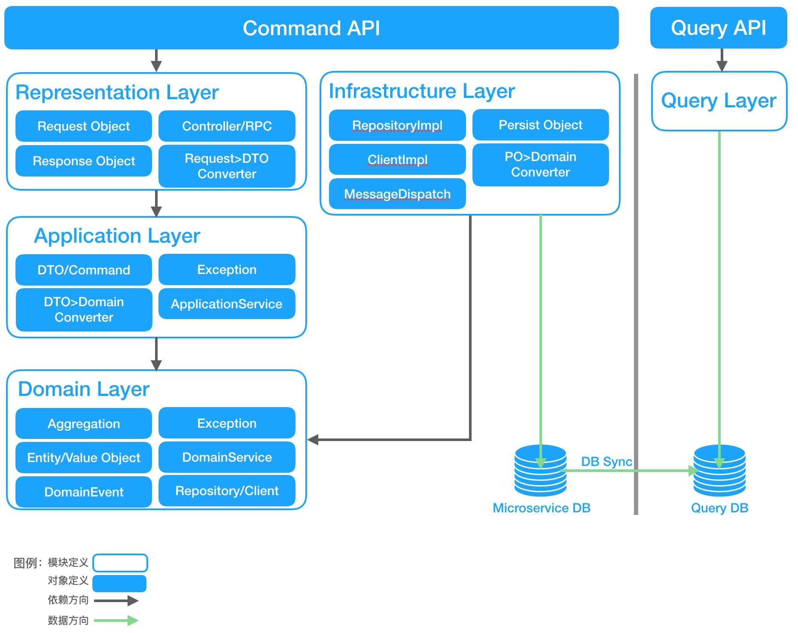
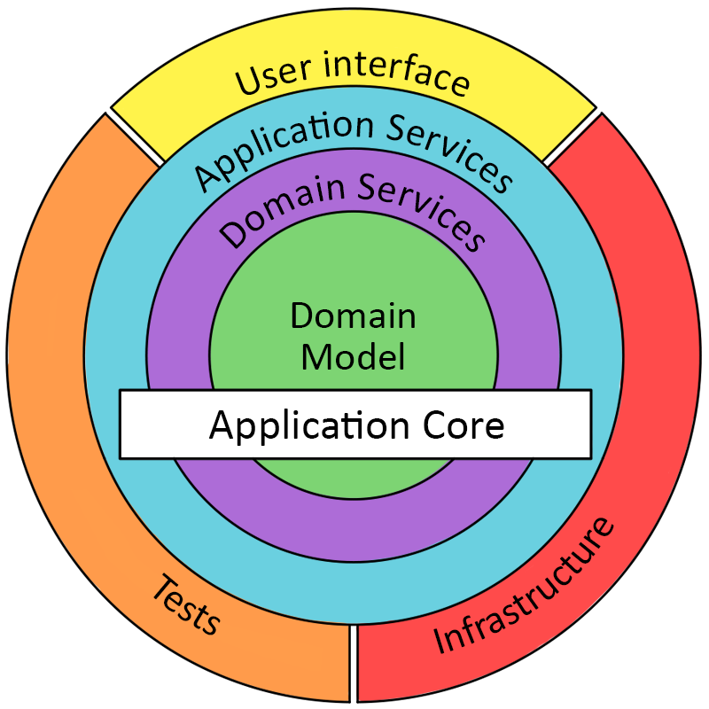

# ddd-code-samples

## Why We Coding This Sample
最近几乎整个IT界都在讨论DDD，但目前来看DDD在很多项目中还处于实践探索阶段，不同的团队产生的DDD实践风格迥异。
写这个sample的目的主要想把好几个项目中总结出来的经验以案例的形式分享出来，供大家在不同的项目中进行参考。
同时也希望能够帮助大家在新的项目中可以更好的借鉴已有经验，减少DDD在实现落地上的资源浪费。

## How To Start This Project

### Prepare Local Environment 

1. 本地需要安装Java, 版本要求：jdk8+

    * MacOS
    * Windows
    * Linux
    
2. 本地需要安装Gradle， 版本要求：gradle5.4+
    * MacOS
    * Windows
    * Linux

### Run Application

1. 通过命令行

    * start 进入工程根目录下，执行 ```gradle bootRun```
    * stop  需要结束程序运行，直接在命令行工具中执行 ```ctrl+c``` 

2. 通过IDE工具(Intellij)

    导入工程到intellij工具中。

    * 工具栏运行按钮

    * gradle插件


## Project Structure



## Business Background

业务基于库存管理的业务进行了脱敏和场景截取。 具体业务流程和细节可以参考下面的流程图等。

关键字： **库存系统**，商品，入库批次，**仓库**，仓库库存，库存出入库指令，库存调拨。

库存系统：
   
    即京西商城的仓库库存管理的系统。

仓库：

    京西商城的实体仓库，在该系统中主要关注的是仓库的配送区域及所持有商品得库存。

仓库库存：

    仓库中商品的库存。
    分别有：
        1. 采购在途数 ： 商品采购完成后入库途中的商品数量，在商品入库（变为实物库存）后需要按照实际入库数量进行变化。
        2. 实物库存： 仓库中商品的实际库存数量。
    
入库：
    
    入库指的是商品采购完成后运输到仓库后，经过盘点和确认后登记到仓库库存的行为。
    
入库批次：
    
    某个商品在入库时的批次，一个入库批次表示某个商品在同一时间内有N个该商品完成入库操作。
    包含： 仓库（仓库编码），商品（商品名称，商品编码，品类编码，供应商编码），入库时间，入库数。

库存出入库指令：


库存调拨：


1. 系统库存管理是通过库存出入库单履行来实现的，库存出入库单履行总共有两大类，分别是：入库单履行，出库单履行。 
   
   其中
    * 入库单履行包含：采购入库，盘盈入库。 
    * 出库单履行包含：盘亏出库，奖品发放。
   同时系统还存在另外一种场景：库存调拨。
   库存调拨： 即从一个仓库调拨商品到另一个仓库以提升仓库的利用率及配送效率。
   ```
    库存调拨需要从一个仓库中把一些商品调出（出库操作），然后把调出的商品调入到其他仓库（入库操作）
   ```
2. 
3. 


## Event-Storming Archive


## Domain Definition

### Aggregate

### Entity

### Value Object

### Domain Service

### Factory

### Domain Event

领域事件是整个DDD中非常核心而且有挑战的地方，特别是一个event的定义需要我们反复斟酌。特别是我们经常会遇到一个领域事件要被很多个地方使用到，
为了满足这些服务所需要的信息，我们不断的增加领域事件中携带的信息，知道我们发现领域事件包含了全部的aggregation信息。

所以在设计领域事件模型的时候，我们建议使用二八原则，我们认为百分之八十的场景只需要一个aggregation的百分之二十的信息即可满足。而对于
剩下的百分之二十的场景，我们可以再对这些场景进行专门的设计和特殊处理。

一个比较有推荐的事件应该包含：
1. 事件发生前聚合的状态
2. 发生的操作/命令/变更（正在尝试寻求一个比较合理的词汇来描述）
3. 事件发生后聚合的状态

这样我们就可以很容易的从事件中获取到一个聚合受到本次变更所产生的影响。

基于以上一些基准，结合这个demo中的业务场景，我们定义的Domain-Event如下：

* InboundOrderSubmittedEvent
* InboundOrderCreatedEvent

## API Style

[**Google API Design Guide**](https://cloud.google.com/apis/design/)


## Architecture Discussion Background
###第一次沟通

1.战术层面架构讨论基础基于Onion Architecture，定义四层代码结构：Representation层、Application层、Domain层、Infrastructure层。各层使用独立Jar包或Module强隔离，各层依赖顺序按图所示从外向内。
  
  
2.Representation层对象包括：
* 包括通过各种协议对外暴露的接口，该层内包含Request/Response对象定义（强制定义此对象，避免直接对外暴露领域对象）。但暂不对Request/Response外的其它DTO对象定义形式有要求，推荐可使用inner class或定义DTO class。
* 基于异常数据尽早拒绝服务的原则，该层包含数据格式校验逻辑，
* 该层包含convert对象定义，负责将Request/Response对象转换为Application层定义的DTO对象，装入Application层定义的Command中，以Application层定义的ApplicationService为入口操作。

3.Test层定义：
* Test中可包含测试金子塔的4类测试，即单元测试、持久层测试、接口层测试、契约测试。
* 如下建议可参考：单元测试是基础；持久层测试运行耗时久且易于发现可省略；接口层测试运行耗时久可考虑在端到端自动化测试中。

4.Application层对象包括：
* 用于入参/出参的DTO类型定义；
* 用于携带DTO数据的Command类型定义；
* 用于异常返回的Exception类型定义；
* ApplicationService类型定义，用于接收并处理Command；在ApplicationService中可使用Domain层定义的的Entity、DomainService、Repository上的方法；Transaction处理；发送DomainEvent；

5.Domain层对象包括：
* Aggregation、Entity、ValueObject类型定义；
* 用于依赖反转的Repository、Client接口类型定义；
* DomainEvent和其携带的DTO数据类型定义在共享包中，在Domain层完成DomainEvent产生；

6.Infrastructure层对象包括：
* 对Domain层定义的Repository的实现类RepositoryImpl，其内部包括JpaRepository；
* 对Domain层定义的Client的实现类ClientImpl，负责加载外部接口数据；
* 消息发送实现类；
* Convert类，用于将DB，第三方数据契约等数据对象转换为Domain层对象；

###第二次沟通
1.对上次讨论的DDD交付代码标准化进行了Review和补充，同时把各层对象的命名规则达成一致。
* Representation层只包括Request/Response对象定义，统一使用Request/Response后缀。其可携带Application层定义的DTO对象。
* Application层包括DTO对象定义，统一使用Request/Response后缀，入口方法使用DTO对象作为入参和出参。
* Domain层Aggregation、Entity、ValueObject等对象不使用后缀；
   * Domain层可定义Domain Exception；
   * Domain Event定义在Domain层（而非之前说的共享包）；Domain Event由Application层显示的发出（Optional）
* Infrastructure层中定义的数据库实体对象统一使用PO（Persist Object）后缀

2.对DDD中引入CQRS，利用Query层解决复杂查询。
* Query层完全独立，不依赖Application、Domain和Infrastructure任何一层。
* Query层引入后后端架构暂不考虑BFF，即BFF归入前端架构选型中。
* Query层独立设计和使用DB Schema，解决复杂查询，跨微服务查询，分页查询时的问题；同时引入了查询数据实效性问题。
   各微服务的数据通过Sync方式到Query DB中。类似于数据报表或宽表设计。Sync技术暂不在考虑。

3.Restful设计风格讨论
* HATEOAS风格，作为Rest成熟度最顶层，暂不引入到标准化中。
* 查询类API的参数传递，推荐使用Get请求，参数在URL中，复杂参数也如此；不使用Get请求参数为json格式或使用Post。
* Restful接口资源Url格式，因为很难定义标准格式，暂不将此项包含在标准化中。
